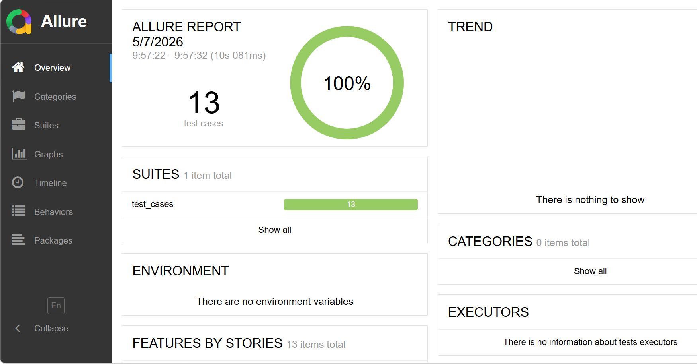
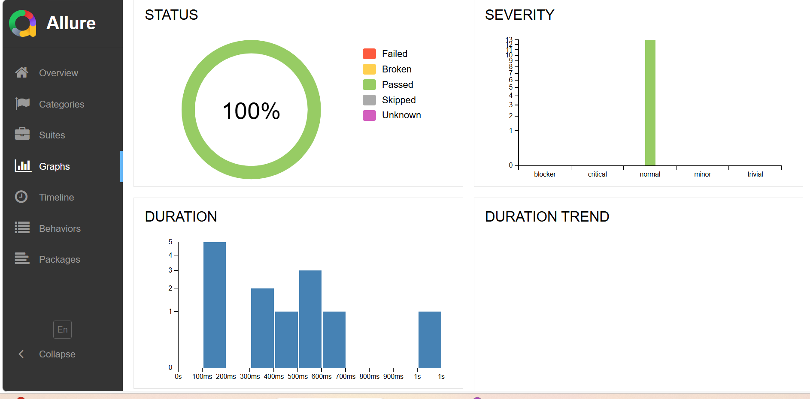
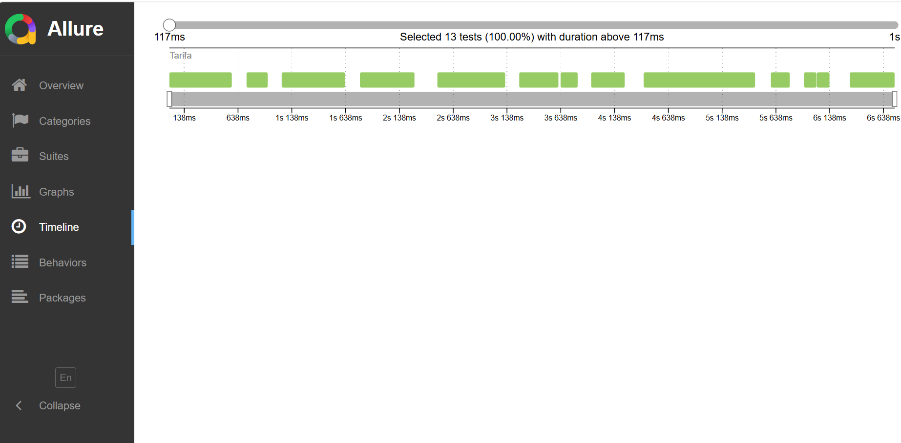

# 🍎 Teacher Management API Automation Framework

[](https://www.python.org/downloads/)
[](https://docs.pytest.org/)
[](https://docs.qameta.io/allure/)
[](https://requests.readthedocs.io/)

This project is a comprehensive **REST API Automation Framework** designed to validate the **Teacher Management APIs**. It focuses on clean code architecture, reusable helper functions, and detailed reporting.

---

## 📊 Test Execution Summary
Below is the execution result from the latest test run:

| Total Tests | Passed ✅ | Failed ❌ | Pass Rate % |
| :--- | :--- | :--- | :--- |
| 13 | 13 | 0 | 100% |

---
## 📊 Test Execution Dashboards

### Allure Overview
Below is the high-level summary of the test execution results, showcasing the pass/fail ratio and overall test health.


### Graphical Analysis
Visual representation of test severity, duration, and status trends.


### Category & Suite Breakdown
Detailed view of test cases organized by their functional categories and suites.


### Execution Timeline
A visual timeline showing when each test was executed and how long it took.

---

## 🚀 Key Features
* **Complete CRUD Validation**: Covers Create, Read, and Delete operations for Teacher profiles.
* **Helper-Driven Design**: Reusable logic for API calls to avoid code duplication.
* **Security Testing**: Validates API behavior with and without Authorization tokens.
* **Negative Scenarios**: Includes tests for invalid emails, missing fields, and non-existent IDs.
* **Environment Management**: Uses `.env` for securing sensitive credentials like `BASE_URL` and `ADMIN_PASS`.

---

## 📂 Project Structure
```text
├── utils/
│   ├── config.py           # Loads environment variables
│   └── helper_functions.py # Core API call wrappers (Post, Get, Delete)
├── test_cases/
│   ├── test_create.py      # Tests for Teacher creation logic
│   └── test_delete.py      # Tests for deletion and edge cases
├── .env                    # Environment variables (BASE_URL, Credentials)
├── .gitignore              # Files to exclude from Git
├── pytest.ini              # Pytest configuration
├── requirements.txt        # Dependencies (pytest, requests, allure-pytest, etc.)
└── README.md               # Project documentation
```
## 👩‍💻 Author
**Israt Jahan Tarifa**
[](https://www.linkedin.com/in/israt-tarifa/) 
[](https://github.com/Israt-Tarifa)
